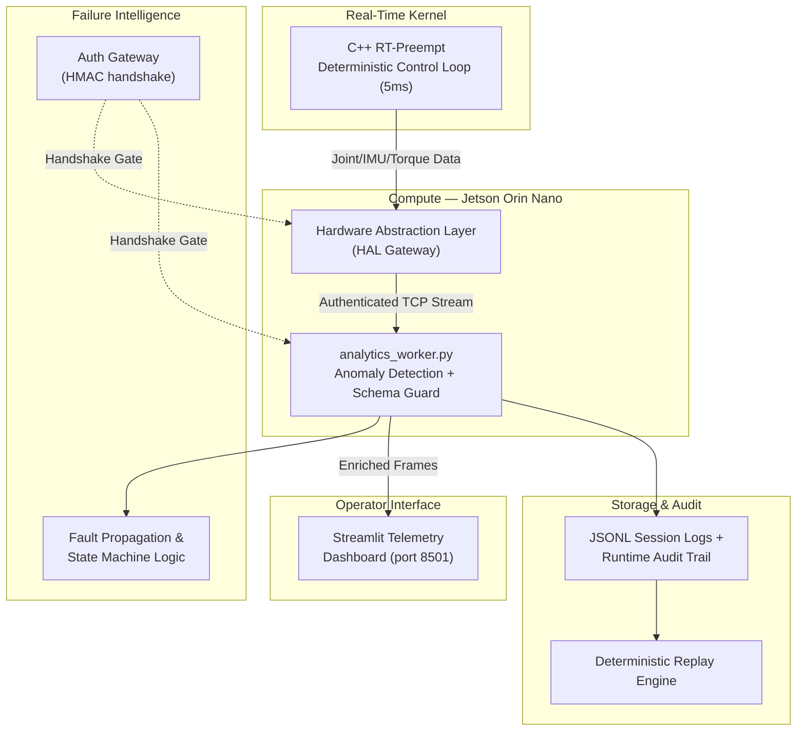

# 🤖 Quadruped Multi-Sensor Telemetry & Failure Intelligence Pipeline

**A real-time, fault-aware telemetry backbone for a quadruped robotics prototype** — built to watch the robot's vitals, catch failures before they cascade, and give operators a live picture of what's actually happening on hardware.

`Contract: v3.0.0-Truth` · `Status: Active Development — Phase 2 (Security & Integration Hardening)`

---

## 📌 What This Is

This isn't a robot controller — it's the robot's **black box and vital-signs monitor combined**. It collects data from every layer of the quadruped stack (locomotion, actuators, terrain, IMU), validates it against a strict schema, detects anomalies statistically, and streams the result to a live dashboard — while keeping a durable audit trail of everything, healthy or not.

The project started as a batch-processed, two-sensor synchronization exercise (IMU + distance sensor, CSV-based) and has since grown into a real-time, socket-based, multi-layer pipeline feeding a physical prototype build.

---

## 🏗️ System Architecture



The stack follows **separation of concerns**: raw acquisition, schema validation, failure reasoning, and presentation are all independent layers that can be developed, tested, and replaced on their own.

| Layer | Responsibility |
|---|---|
| **Hardware Abstraction (`Hardware/`)** | Bridges physical/simulated sensors (joints, IMU, torque, contact) into the canonical schema; injects and models realistic fault modes (thermal evolution, actuator degradation, sensor noise). |
| **Telemetry Core (`Telemetry/`)** | Orchestrates the control loop, runs the fault-intelligence state machine, and manages live vs. replay execution modes. |
| **Analytics (`analytics/`, `analytics_worker.py`)** | Statistical anomaly detection (rolling z-score), schema contract enforcement, per-frame stability scoring. |
| **Security (`security/`)** | HMAC shared-secret handshake gating every socket connection — no peer is trusted without authenticating first. |
| **Observability (`metrics/`)** | Deterministic runtime monitoring, deadline-compliance tracking, structured JSONL audit logs. |
| **Storage & Replay (`storage/`, `replay/`)** | Black-box session recording and deterministic replay for regression testing and post-mission audit. |
| **Presentation (`visualization/`)** | Streamlit dashboard — live stability score, latency-vs-deadline charts, per-limb thermal/torque breakdown. |

---

## 🚀 Key Features

### 1. Deterministic, Contract-Enforced Telemetry
Every frame carries a `contract_version` (`v3.0.0-Truth`) and is checked against a formal JSON Schema (`schema/canonical_telemetry_v3.json`) before it's trusted anywhere downstream. Frames that fail — wrong version, missing fields, malformed structure — are rejected with a specific reason, logged, and skipped, **not** allowed to silently corrupt state.

### 2. Failure Intelligence, Not Just Threshold Checks
The pipeline reasons about *combinations* of signals rather than single-value thresholds:
- IMU stable + terrain reading changing ⇒ flagged as a likely sensor fault, not a real terrain event.
- `ACTUATOR_BUS_TIMEOUT` propagates automatically into `DEGRADED` health, a `SAFE_FALLBACK` control mode, and a throttled `CURRENT_LIMITED` actuation state — modeled explicitly in the fault propagation matrix.
- A `GHOST_DIVE` (impossible sensor spike) triggers a full `EMERGENCY_STOP` with self-righting recovery — not a warning log buried in a terminal.

### 3. Statistical Anomaly Detection
A rolling-window z-score detector (`analytics/anomaly_detector.py`) flags latency and behavioral anomalies against *recent* history rather than a fixed cutoff, so it adapts as operating conditions shift (e.g. gait change, terrain change) without needing constant re-tuning.

### 4. Authentication on Every Socket (Phase 2)
Previously, any local process could attach to the telemetry sockets with zero verification. Every connection — edge → analytics, analytics → dashboard — now completes an **HMAC-SHA256 challenge-response handshake** before a single frame is exchanged. Unauthenticated or credential-mismatched peers are rejected and the server keeps serving, rather than trusting whoever connects first.

### 5. Error Boundaries That Actually Hold
A single malformed frame — bad JSON, a missing field, an unexpected type — no longer takes down the entire analytics worker. Each frame is validated and processed independently; failures are logged with the specific reason and the pipeline keeps running.

### 6. Full Session Recording & Deterministic Replay
Every live session can be replayed byte-for-byte from `quadruped_session_recording.jsonl` — the same frames, same order, same timing — which makes regression testing and fault-injection testing fully reproducible instead of "it happened once and I can't get it back."

### 7. Long-Run Reliability, Verified
A 350-frame continuous stress run (exceeding the 300-frame reliability baseline) showed:
- Mean processing latency **4.22 ms** against a 4.00 ms target, max peak 5.82 ms
- **+0.2 MB** net memory growth over the full run — no leak signature
- **100%** structural frame ingestion validity
- Three injected anomalies (dropped frame, actuator bus timeout, low-traction event) all correctly isolated without destabilizing playback

### 8. Live Operator Dashboard
A Streamlit cockpit (port 8501) shows system status, locomotion stability score history, latency-vs-deadline tracking, and a per-limb thermal/torque/gait breakdown — refreshed in real time from the authenticated telemetry stream.

---

## 🔄 Data Flow

```
Physical / Simulated Sensors
        │
        ▼
Hardware Abstraction Layer  ──▶  [Auth Handshake]  ──▶  analytics_worker.py
        │                                                       │
        │                                          Schema Validation
        │                                          Anomaly Detection
        │                                          Fault Propagation Logic
        │                                                       │
        ▼                                                       ▼
 quadruped_session_recording.jsonl                 [Auth Handshake] ──▶ Streamlit Dashboard
        │
        ▼
Deterministic Replay Engine (regression / fault-injection testing)
```

---

## 🛠️ Failure Scenarios Currently Handled

| Fault | System Response |
|---|---|
| `ACTUATOR_BUS_TIMEOUT` | Health → `DEGRADED`, control → `SAFE_FALLBACK`, gait → `RECOVERY_PULSE`, bus → `TIMEOUT_CRITICAL` |
| `GHOST_DIVE` (impossible sensor spike) | Health → `EMERGENCY_STOP`, velocity locked to zero, `SELF_RIGHTING` recovery, actuators forced to `THERMAL_FAULT` shutdown |
| Sensor spikes / out-of-range readings | Caught by threshold + schema validation before reaching downstream logic |
| Temporal drift (multi-rate sensors) | Resolved via nearest-neighbor timestamp matching (10 Hz IMU vs. 2 Hz terrain sensing) |
| Malformed / corrupted frames | Dropped per-frame with logged reason; worker keeps running |
| Unauthenticated connection attempts | Rejected at the handshake stage, before any frame is exchanged |
| Stale / missing data | Flagged via timeout + null-value guards rather than treated as fresh |

---

## 📊 Current Status & Honest Limitations

This project is under active development. In the interest of an accurate README rather than an aspirational one:

- ✅ Schema validation, fault propagation modeling, anomaly detection, socket authentication, and per-frame error boundaries are implemented and covered by automated tests.
- ✅ 350-frame long-run reliability test passed with no memory leak signature.
- ⚠️ The socket authentication layer uses a shared secret (`TELEMETRY_SHARED_SECRET`), not per-node identity or TLS — sufficient for a single-operator prototype, not for a multi-service production deployment.
- ⚠️ Telemetry is still plaintext on the wire after the handshake; add TLS before this ever leaves `127.0.0.1`.
- ⚠️ Real-time streaming from the physical Jetson/RT-kernel stack is still being integrated alongside the existing simulated/replay data paths.

---

## 🗺️ Roadmap

- [ ] TLS/mTLS on top of the existing auth handshake, for anything beyond localhost
- [ ] Full ROS 2 migration for the transport layer (native multi-subscriber support, automatic reconnection)
- [ ] Gazebo-simulated sensor feeds (IMU, joint states, contact forces) as a drop-in replacement for synthetic data, once the pipeline itself is fully hardened
- [ ] Historical trend dashboards backed by a time-series database
- [ ] Alerting (Slack/webhook) on sustained `CRITICAL_FAULTS` or repeated anomalies
- [ ] Hardware-in-the-loop validation once the physical prototype's sensor suite is fully wired

---

## 🧪 Running the Tests

```bash
pip install -r requirements.txt
export TELEMETRY_SHARED_SECRET="your-shared-secret-here"   # required — the pipeline will not start without it
pytest -v
```

---

## 👥 Team

Built as a cross-disciplinary robotics prototype effort spanning mechanical design, physical/subsystem layout, and the telemetry & observability pipeline documented here.

*(Update this section with full names/roles as you'd like them credited — pulled placeholder attribution from internal docs, please verify before publishing.)*

---

## 📝 Assumptions

- System clock is synchronized and timestamps move strictly forward.
- Declared sensor sampling rates hold without uncontrolled jitter.
- Physical/mission-environment thresholds (e.g. terrain distance limits) reflect the current test environment and will need revisiting for new deployments.
