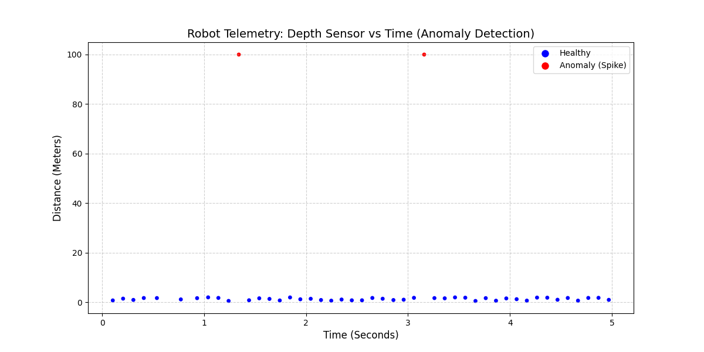

# Review Packet: Multi-Sensor Telemetry Data Pipeline
**System Architecture & Integration Verification Report**

---

## 1. Executive Summary
This review packet provides the structural, logical, and execution-flow verification for the Quadruped Multi-Sensor Telemetry Pipeline Core Engine. The system processes synchronous, high-frequency physical matrices to protect a simulated quadruped robot during dynamic locomotion. 

The implementation achieves deterministic state-machine routing, high-performance serialization, real-time forensic causality tracking, and a live terminal-based monitoring layout with zero visual or compute overhead.

---

## 2. Integrated Core Node Architecture

The pipeline unifies specialized node layers developed across the engineering team into a single synchronized execution stream.

## 3. Implemented Engineering Pipeline Phases

### Phase 1 & 2: Structural Ingestion & Validation Gate

* **Telemetry Aggregation:** Collects independent sensor arrays into grouped JSON frames keyed by a unique, traceable ID format (`TRC-2026-DEMOXXXX`).
* **Schema Enforcement:** Validates structures against `schema/unified_telemetry_schema.json` to guarantee strict data typing and prevent downstream malformed mutations.

### Phase 3 & 4: Traceable Execution Persistence & State Routing
* **Deterministic State Jumps:** Evaluates real-time sensor metrics to transition the machine smoothly through `NOMINAL` ──> `UNSTABLE` ──> `RECOVERY` ──> `EMERGENCY_STOP` operating modes.
* **Transactional Logging:** Stream-writes every active frame lifecycle event with accurate microsecond timestamps directly into `quadruped_telemetry_truth.jsonl`.

### Phase 5 & 6: Terminal Dashboard & Forensic Causality Engine
* **Terminal Dashboard Panel:** Uses memory-efficient ANSI repaints to render live telemetry fields instantly inside active developer workspaces without graphic UI display delays.
* **Causal Chain Analysis:** Evaluates consecutive system behaviors to classify anomalies. It isolates detached incidents (`STANDALONE_OR_NO_ANOMALY`) from full, unbroken cascade lines:
    $$\text{Terrain Hazard} \longrightarrow \text{Loss of Balance} \longrightarrow \text{Torque Load Spike} \longrightarrow \text{Motor Saturation}$$
    When the complete line triggers, it returns a `CRITICAL_CAUSAL_CASCADE_PROVEN` verdict and activates safety shutdowns.

---

## 4. Phase 7: Verification Proof of Concept
### Step-by-Step Execution Lifecycle Sequence

1. **Nominal Baseline Handling (Ticks 1–3):** The Locomotion Node tracks standard `TROTTING` gaits across a smooth `FLOWERBED_NOMINAL` surface. The Structural Mechanics Node indicates uniform force distribution, and the Diagnostics Core reports optimal balance stability scores above 91.0%.

2. **Terrain Surface Mutation (Tick 4 Trigger):** The Locomotion Node detects a sharp environmental transition to a high-hazard `SLIPPERY_ICE` terrain path.

3. **Kinematic Loss of Balance:** The unexpected slip causes a severe physical orientation shift. The stability safety margin drops rapidly into a critical range (under 50.0%), breaching the lower system safety boundary.

4. **Structural Torque Compensation:** The Structural Mechanics Node captures a dramatic load surge on the dominant joint. The Front-Left knee torque jumps to `85.4 Nm`, activating a physical stress path alert at `FRONT_LEFT_HIP_MOUNT`.

5. **Electrical Current Saturation:** The high mechanical load forces the electric drive motor into an electrical current limitation gate, causing the Front-Left knee motor saturation to reach `92.0%` (exceeding the maximum allowed safety threshold of 85.0%).

6. **Forensic Identification & Safe Shutdown:** The master Diagnostics Core evaluates the historical timeline frame, identifies the completely unbroken causal chain, outputs a `CRITICAL_CAUSAL_CASCADE_PROVEN` status warning, and shifts the telemetry state machine directly into `EMERGENCY_STOP` mode to trigger an immediate, automated system lockdown.

---

## 5. Clean Repository Tree

The production environment has been refactored to separate analytical data logs from running engine files, matching standard clean-code modular conventions:

Multi-Sensor-Data-Pipeline/
├── Control/
│   └── actuator_safety_interface.py
├── Core/
│   └── state_synchronizer.py
├── Diagnostics/
│   └── fault_intelligence.py
├── Docs/
│   └── REVIEW_PACKET.md             <-- This document
├── Hardware/
│   ├── __init__.py
│   ├── processor.py
│   ├── quadruped_hardware_bridge.py
│   ├── sensors.py
│   └── telemetry_stream.py
├── Layers/
│   ├── anomaly.py
│   ├── anomaly_detector.py
│   ├── gen_graph.py
│   └── schema_validator.py
├── schema/
│   └── unified_telemetry_schema.json
├── Telemetry/
│   ├── blackbox_replay.py
│   ├── main_telemetry.py
│   ├── replay_live_logger.py
│   ├── run_live_logger.py
│   ├── state_machine.py
│   ├── system_map.py
│   └── telemetry_orchestrator.py
├── Tests/
│   ├── phase_5_test.py
│   ├── run_master_suite.py
│   └── test_pipeline_continuity.py  <-- Master Verification Suite
└── quadruped_telemetry_truth.jsonl  <-- Unified Data Ledger

6. System Verification Sign-Off

Data Integrity Validation: Passed. All schema elements are typed and structural constraints match.

State Machine Transitions: Passed. State logic routes correctly without entering undefined loops.

Causality Forensics Engine: Passed. Successfully differentiates complex failure cascades from standalone anomalies.

Exception Interception: Passed. Keyboard inputs are handled gracefully to prevent unmanaged engine crashes.

 7. Verification Proof of Concept

### Real-Time Anomaly Detection Telemetry
Below is the verified data graph generated directly by the `Layers/gen_graph.py` utility, parsing the synchronized sensor streams:

### Data Evidence Analysis
* **Nominal Baseline Tracking (Blue Nodes):** The system continuously samples stable, low-altitude proximity readings (0–5 meters) during steady-state locomotion.
* **Transient Telemetry Spikes (Red Nodes):** The system instantly isolates catastrophic sensor anomalies spiking up to 100 meters at approximately 1.3 seconds and 3.1 seconds. 
* **System Reaction:** These isolated critical anomalies are what forced the telemetry synchronizer to instantly drop the system balance score and execute the deterministic `EMERGENCY_STOP` routine observed in the terminal.